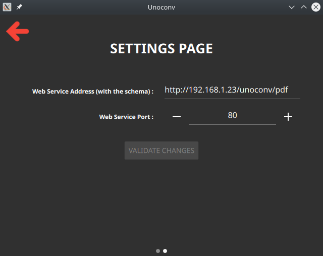

# UnoconvUI


Unoconv UI is a client app for the [Unoconv Web Service](https://github.com/SCOTT-HAMILTON/docker-unoconv-webservice) written in Qt.
It's available on Linux, Windows and Android. (It takes a bit of place on android phones, sorry but I'm not gonna write UI's in java XD).

### Requirements

Unoconv UI requires : 
 - QtBase
 - lrelease for translations (in either qttools or qtlinguist packages)
 - QtQuickControls2
 - rsvg-convert (provided by librsvg2)

### Qmake Building 

  To build it, run : 
```sh
  $ qmake QT_INSTALL_PREFIX=/usr # Or any prefix where you want to install Unoconv UI
  $ make -j4
  $ make INSTALL_ROOT=/usr install # Same as QT_INSTALL_PREFIX
```

_____________


### Installation

# On Fedora : 

```sh
  $ sudo dnf config-manager --add-repo https://download.opensuse.org/repositories/home:/ScottHamilton/Fedora_31/home:ScottHamilton.repo
  $ sudo dnf install unoconvui
```
 > replace `Fedora_31` with your version, supported are `Fedora_30`, `Fedora_31`, `Fedora_32`, `Fedora_33` and `Fedora_Rawhide`

# On openSuse : 

```sh
  $ sudo zypper ar -f https://download.opensuse.org/repositories/home:/ScottHamilton/openSUSE_Tumbleweed/home:ScottHamilton.repo ScottHamilton
  $ sudo zypper install unoconvui
```
 > replace `openSUSE_Tumbleweed` with your version, supported are `SLE_15`, `openSUSE_Factory_RISCV`, `openSUSE_Leap_15.1`, `openSUSE_Leap_15.2`,
 > and `openSUSE_Tumbleweed`

Others might be supported, check [Unoconv UI's OBS page](https://build.opensuse.org/package/show/home:ScottHamilton/UnoconvUI).

# On NixOS or nix enabled distributions : 

First configure NUR, see [NUR Configuration](https://github.com/nix-community/NUR#installation)
Then you can install Unoconv UI.

With the system `configuration.nix` file on NixOS : 
```nix
# configuration.nix
{
  environment.systemPackages = with pkgs; [
    nur.repos.shamilton.unoconvui
  ];
}
```
Or with home-manager : 
```nix
# home.nix
{
  home.packages = [
    nur.repos.shamilton.unoconvui
  ];
}
```

# On Android And Windows

Apk for Android and Installer for Windows are comming in first release.

# MacOS

PR me if you want this on MacOS. It probably needs some modifications but I don't
see anything that wouldn't work on MacOS. I can't maintain a build on that plateform though
for obvious hardware reasons.


### Usage

Here is the start page.
Select a file and wan't for the web service to convert it.
You can check debug area for some issues.


The settings page lets you set the address and the port of your web service.


 > NB : The Settings Page UI is responsive !

### Help

Unoconv UI is just a little project, but feel free to fork, change, extend or correct the code or to add translations.

### Warning

**As said above, this uses Qt and QML for the UI. The android app takes a lot of place because of the Qt libs, this can be reduced by using the ministro service.**


License
----
Unoconv UI is delivered as it is under the well known MIT License


**References that helped**
 - [Android Developer Doc] : <http://developer.android.com/>
 - [HttpURLConnection] : <https://developer.android.com/reference/java/net/HttpURLConnection>
 - [KDAB's amazing serie on Qt and Android] : <https://www.kdab.com/qt-android-episode-7/>
 - [Wireshark] : <https://www.wireshark.org/>

[//]: # (These are reference links used in the body of this note and get stripped out when the markdown processor does its job. There is no need to format nicely because it shouldn't be seen. Thanks SO - http://stackoverflow.com/questions/4823468/store-comments-in-markdown-syntax)


   [Android Developer Doc]: <http://developer.android.com/>
   [HttpURLConnection]: <https://developer.android.com/reference/java/net/HttpURLConnection>
   [KDAB's amazing serie on Qt and Android]: <https://www.kdab.com/qt-android-episode-7/>
   [Wireshark]: <https://www.wireshark.org/>
